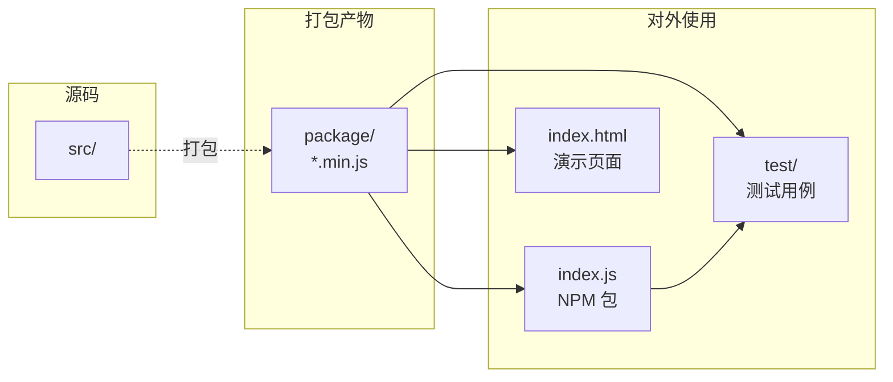
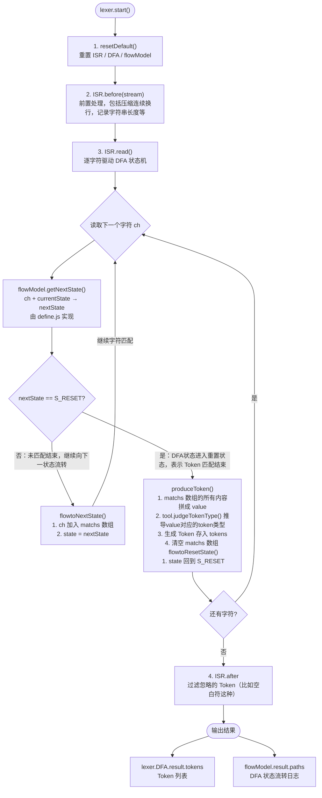

# 源码讲解

> 注意: 本源码讲解文档适用于```1.x```版本系列

本文会对项目的源码进行详细讲解，欢迎讨论

### 目录

- [一、项目结构](#1)
- [二、语言扩展](#2)
- &nbsp;&nbsp;&nbsp;&nbsp;&nbsp;[1、定义常量](#21)
- &nbsp;&nbsp;&nbsp;&nbsp;&nbsp;[2、定义函数工具包](#22)
- &nbsp;&nbsp;&nbsp;&nbsp;&nbsp;[3、定义自动化测试](#23)
- &nbsp;&nbsp;&nbsp;&nbsp;&nbsp;[4、定义状态流转模型](#24)
- [三、词法分析器核心](#3)
- &nbsp;&nbsp;&nbsp;&nbsp;&nbsp;[1、模块构成](#31)
- &nbsp;&nbsp;&nbsp;&nbsp;&nbsp;[2、各司其职](#32)
- &nbsp;&nbsp;&nbsp;&nbsp;&nbsp;[3、ISR介绍](#33)
- &nbsp;&nbsp;&nbsp;&nbsp;&nbsp;[4、DFA介绍](#34)
- &nbsp;&nbsp;&nbsp;&nbsp;&nbsp;[5、时间复杂度](#35)
- &nbsp;&nbsp;&nbsp;&nbsp;&nbsp;[6、核心流程图](#36)
- [四、开发实践](#4)
- &nbsp;&nbsp;&nbsp;&nbsp;&nbsp;[1、快速开始](#41)
- &nbsp;&nbsp;&nbsp;&nbsp;&nbsp;[2、语法细节调整](#42)
- &nbsp;&nbsp;&nbsp;&nbsp;&nbsp;[3、单元测试](#43)
- &nbsp;&nbsp;&nbsp;&nbsp;&nbsp;[4、自动化测试](#44)
- [五、开发规范](#5)
- &nbsp;&nbsp;&nbsp;&nbsp;&nbsp;[1、Git相关](#51)
- &nbsp;&nbsp;&nbsp;&nbsp;&nbsp;[2、发布Npm](#52)

## <span id="1">一、项目结构</span>

```
lexer/
├── src/                    # 源码目录（仅供开发使用，阅读与修改，不对外直接使用）
│   ├── lexer.js            #   词法分析器核心
│   └── lang/               #   各语言扩展定义
│       ├── c-define.js
│       ├── goal-define.js
│       └── sql-define.js
├── package/                # 打包产物目录（所有上层使用均基于此目录）
│   ├── pack.sh             #   打包脚本
│   ├── main.js             #   打包入口
│   ├── c/
│   │   ├── c-define.min.js #   C语言定义包（含常量、工具函数、FlowModel）
│   │   └── c-lexer.min.js  #   C语言词法分析包（含完整词法分析能力）
│   ├── sql/  ...           #   SQL语言同上
│   └── goal/ ...           #   Goal语言同上
├── test/                   # 测试目录（使用 package/ 中的产物，不直接引用 src/）
│   ├── test.sh             #   一键执行全部测试
│   ├── main.js             #   测试入口
│   ├── unit/               #   单元测试用例
│   └── auto/               #   自动化测试用例
├── index.js                # npm 包入口（基于 package/ 产物对外暴露）
├── index.html              # 在线演示页面（使用 package/ 中的产物，不直接引用 src/）
└── doc/                    # 文档与图片资源
```

关于src目录、package目录、test目录等关系，其结构图如下所示。

> **重要约定**：
> 1. `src/`：是内部源码目录，仅用于开发与修改，不对外直接使用。
> 2. `package/`：是所有上层使用的基础目录，**测试、打包、NPM 等所有上层使用，均基于 `package/` 目录下的打包产物（`*.min.js`），不直接依赖 `src/` 源码。**
> 3. `index.js/index.html`：均基于 `package/` 目录
> 4. `test/`：是测试目录。通过引入`package/`目录文件对test/unit的单测目录和test/auto的自动化测试目录进行测试，也通过引入根目录`index.js`测试 NPM 包。



## <span id="2">二、语言扩展</span>

实现语言扩展的方式很简单，在 `src/lang/` 目录下创建一个 `{lang}-define.js` 文件，然后按照如下步骤操作。完成后通过 `bash package/pack.sh` 打包，生成 `package/{lang}/` 下的产物供上层使用。

### <span id="21">1、定义常量</span>

- \[必须\] 定义```枚举型```常量，如```符号```、```状态值```等
- \[必须\] 定义```字符集合```型常量，包括```单字符```、```双字符```、```双字符首位符```、```双字符次位符```，```关键字```，其中```单字符```又分为```运算符```、```符号```
  、```空白符```
- \[必须\] 定义```DFA```的```STATE```常量

```js
const ENUM_CONST = [];
const CHARSET_CONST = [];
const DFA_STATE_CONST = [];
```

### <span id="22">2、定义函数工具包</span>

以C语言版本为例，主要定义了如下函数

- ```judgeTokenTypeByValue(value)``` 通过```Value```值判断```Token```的类型，如```关键字```类型的```Token```可以直接通过```Value```值判断
- ```judgeTokenType(state, value)``` 判断```Token```的类型，包括根据```Value```判断和根据```State```判断两种
- ```getFirstCharState(ch)``` 如果是```双字符首位符```则返回对应的```state```，否则返回```S_RESET```重置状态
- ```getSecondCharState(ch)``` 如果是```双字符次位符```则返回对应的```state```，否则返回```S_RESET```重置状态

> 如何实现和PHP一样关键字不区分大小写的效果呢？很简单，在```judgeTokenTypeByValue(value)```函数中将Value转小写进行比较即可，可以参考 `src/lang/sql-define.js` 中的实现

### <span id="23">3、定义自动化测试用例</span>

在 `test/auto/` 目录下为每种语言创建对应的测试文件（如 `c-lexer_test.js`），在文件中实现 `returnCaseList()` 函数返回所有测试 Case 即可，每一个测试 Case 必须定义 `input` 和 `output` 两种属性

- `input` 表示输入的待处理字符序列
- `output` 表示预期的输出结果，根据不同严格程度的测试，选择使用数字（预期的 `token` 数量）或数组（预期的 `token` 列表）中的任一种类型

```js
function returnCaseList() {
    return [
        // 严格: 生成的每一个token的类型、值必须完全一致，才说明测试通过
        {
            'input': "int",
            'output': [{"type": "Keyword", "value": "int"}],
        },

        // 宽松: 只要最后生成的token数量是1个，就说明测试通过
        {
            'input': "int",
            'output': 1,
        },
    ];
}
```

### <span id="24">4、定义状态流转模型（FlowModel）</span>

这一节是整个语言扩展环节中最核心的部分，其思想是用户定义自己的状态流转模型

- ```result```属性，用于定义结果部分，主要包括```paths```状态流转记录
- ```resultChange```属性，用于定义修改结果时需要调用的函数，主要包括```pathGrow()```状态流转记录函数，和```toDefault()```结果重置
- ```getNextState```函数，通过输入的```字符```和当前的```状态```，来判断```下一次```要```流转```的```状态```

```js
let flowModel = {
    result: {
        paths: [],
    },
    resultChange: {
        pathGrow(path) {
            flowModel.result.paths.push(path)
        },
        toDefault() {
            flowModel.result.paths = [];
        }
    },

    getNextState(ch, state, matchs) {

        // ... 逻辑处理

        return nextState;
    }
}
```

## <span id="3">三、词法分析器核心</span>

### <span id="31">1、模块构成</span>

`src/lexer.js` 是词法分析器的核心源码文件（不对外直接使用，打包后以 `{lang}-lexer.min.js` 的形式对外提供），其中定义的 `lexer` 变量即是词法分析器核心，它主要有以下两部分构成
- ISR（Input Stream Reader）输入流读取器
- DFA（Deterministic finite automaton）有限状态自动机

其它的如```resetDefault()```和```start()```等方法都是```lexer```对外提供的交互接口，不属于词法分析器的核心模块，不在讨论范畴
### <span id="32">2、各司其职</span>

词法分析器首先需要读取输入的字符串，然后才能做相应处理，所以```ISR```负责整个输入流读取的控制，```DFA```负责判断应当对当前输入的字符序列做什么相应操作

- ISR ：负责对输入字符序列的控制，如开始读取、读取下一个字符、停止读取等
- DFA ：负责对状态流转的控制，如流向下一个状态、流向自身状态、回到重置状态

### <span id="33">3、ISR介绍</span>

```ISR```的核心是```read()```函数，不仅控制字符的读取，内部还有两个最重要的机制，即```match```与```end```

- ```match```如果是```true```，表示```DFA```判断可以流转到下一个状态，即当前字符匹配成功，需要把字符下标```+1```，读取下一个字符。 
- ```match```如果是```false```，表示```DFA```判断无法流转到下一个状态，需要通知```DFA```生成```token```，并回到重置状态
- ```end```如果是```traue```，表示当前是否是最后一个字符，不再读取字符，直接通知```DFA```生成```token```

### <span id="34">4、DFA介绍</span>

```ISR```读取字符后，会传给```DFA```，```DFA```会根据当前的```state```状态，把下一次应该流向的```state```状态返回给```ISR```

### <span id="35">5、时间复杂度</span>
```lexer```的时间复杂度，即是```ISR```与```DFA```的时间复杂度之和

- ```DFA```只根据当前状态判断下一个状态且无循环、无递归，时间复杂度是O(1)
- ```ISR```需要依次读入字符直到读取结束，时间复杂度为```O(N)```

所以```lexer```时间复杂度为```O(N)```，即耗时会随着字符串输入的增加而线性增长

### <span id="36">6、核心流程图</span>

```lexer```的工作原理，如以下核心流程图所示。



## <span id="4">四、开发实践</span>

### <span id="41">1、快速开始</span>

如需要新增一个```Y语言```的扩展，复制 `src/lang/c-define.js` 文件并命名为 `src/lang/y-define.js`，再修改```CHARSET_CONST.KEYWORD```中定义的```关键字```即可。完成后执行 `bash package/pack.sh` 打包，即可在 `package/y/` 目录下得到对应的产物。

如果没有调整语言细节的需求，截止到当前步骤```Y语言的扩展```已经完成啦~

> 由于编程语言的思想都是通用的，所以无论什么语言，都基本离不开```Operator```、```DoubleOperator```、```Symbol```、```Whitespace```、```Keyword```、```Identifier```、```Number```、```Float```、```String```这几种```Token```，而这些```Token```都已经定义过了，所以需要额外添加和修改的代价还是较低的

### <span id="42">2、语法细节调整</span>

不同语言的语法细节是不同的，比如PHP语言中支持```===```或```!===```三个符号的运算符，PHP只有```String```类型，没有```Char```类型等等，这些都是与C语言不同的

如果有调整语言细节的需求，建议参考根据[《第二节》](#2)中的讲解，去修改 `src/lang/{lang}-define.js` 源码，修改完毕后重新打包。

### <span id="43">3、单元测试</span>

单元测试用于验证各语言扩展的词法定义（常量、工具函数等）是否正确，测试文件位于 `test/unit/` 目录下，如 `c-define_test.js`。

> 单元测试加载的是 `package/{lang}/{lang}-define.min.js` 打包产物，而非 `src/` 源码。执行前请确保已完成打包。

在单元测试文件中，需要实现 `runUnitTesting(showProcess)` 函数，函数内部直接访问由 `{lang}-define.min.js` 暴露到全局的 `tool`、`flowModel` 等对象：

```js
function runUnitTesting(showProcess) {
    if (tool.isUndefined(flowModel.FakeValue) === true) {
        if (showProcess) console.info("1. Test success: tool.isUndefined");
    } else {
        console.error("1. Test failed: tool.isUndefined");
        return false;
    }
    return true;
}
```

执行命令（在项目根目录下运行）：

```bash
# 单独执行某语言的单元测试
node test/main.js c 1 unit/c-define_test.js 1

# 一键运行全部测试（推荐）
bash test/test.sh
```

### <span id="44">4、自动化测试</span>

自动化测试用于对大量输入字符串执行词法分析，验证输出 Token 是否符合预期，测试文件位于 `test/auto/` 目录下，如 `c-lexer_test.js`。

> 自动化测试同样基于 `package/` 目录下的打包产物运行，不直接依赖 `src/` 源码。

测试分为两种模式：
- **类型 2**：直接加载 `{lang}-lexer.min.js` 运行词法分析（验证打包产物）
- **类型 3**：通过 `require('index.js')` 模拟 npm 包使用方式（验证 npm 包导出）

执行命令（在项目根目录下运行）：

```bash
# 自动化测试（验证打包产物）
node test/main.js c 2 auto/c-lexer_test.js 1

# Npm 测试（模拟 npm 包使用）
node test/main.js c 3 auto/c-lexer_test.js 1

# 一键运行全部测试（推荐）
bash test/test.sh
```

> 注意：执行测试前，需确保已运行 `bash package/pack.sh` 生成最新的打包产物，否则测试的是旧版本代码。测试与打包均不直接使用 `src/` 源码。
